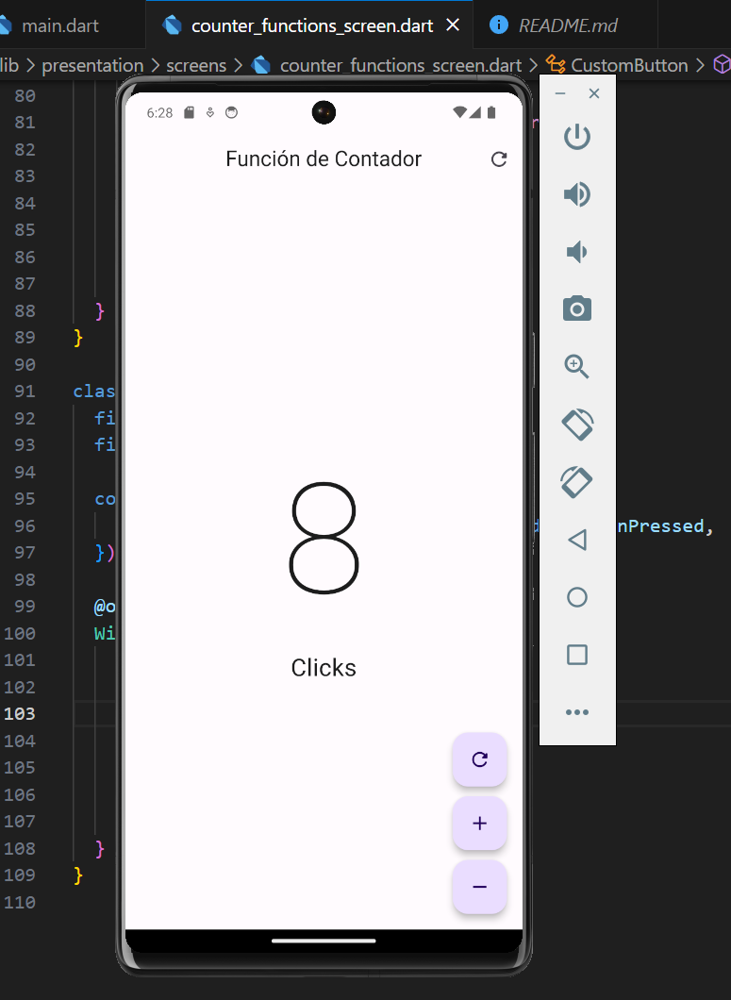
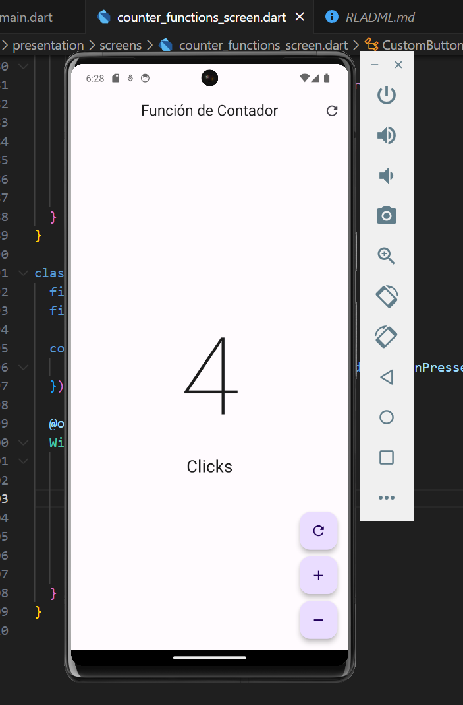

# Introducción a la Aplicación Flutter

Este proyecto Flutter es una aplicación simple de contador que permite a los usuarios incrementar, decrementar y reiniciar un contador. Demuestra conceptos básicos de Flutter y el uso de widgets.

### **Seleccionar Idioma:**
- [Español](README-es.md)
- [Inglés](README.md)

## Resultado
### Inicio
 
### Sumar
 
### Restar 

### Reiniciar
 

### Inicio Rápido

1. Asegúrese de tener Flutter instalado. Si no lo tiene, siga la [guía oficial de instalación de Flutter](https://flutter.dev/docs/get-started/install).
2. Clone este repositorio en su máquina local.

```bash
git clone https://github.com/Anyel-ec/INTRODUCE-DART-FLUTTER-DEVMOVIL
```

3. Navegue al directorio del proyecto.

```bash
cd hello_word_app
```

4. Ejecute la aplicación.

```bash
flutter run
```

### Estructura del Proyecto

El proyecto está organizado en los siguientes archivos principales:

- **main.dart**: Punto de entrada de la aplicación, donde se define la clase `MyApp`.
- **counter_functions_screen.dart**: Contiene el widget `CounterFuntionsScreen`, que representa la pantalla principal de la aplicación.
- **custom_button.dart**: Define el widget `CustomButton`, que es un botón flotante personalizado reutilizable.

### Cómo Utilizar

1. Inicie la aplicación y se le presentará la pantalla principal.
2. El valor del contador se muestra en un tamaño de fuente grande en el centro de la pantalla.
3. Utilice los botones flotantes en la parte inferior para interactuar con el contador:
   - **Botón de Reinicio**: Reinicia el contador a 0.
   - **Botón de Suma**: Incrementa el contador.
   - **Botón de Resta**: Decrementa el contador (deshabilitado cuando el contador ya está en 0).

### Visión General del Código

- **Clase MyApp**: La clase principal de la aplicación que configura el tema e inicializa `CounterFuntionsScreen`.
- **Clase CounterFuntionsScreen**: Representa la pantalla principal de la aplicación. Utiliza `_CounterFuntionsScreenState` para gestionar el estado del contador.
- **Clase CustomButton**: Un botón flotante personalizado reutilizable que toma un icono y una devolución de llamada `onPressed`.

### Licencia

Este proyecto está licenciado bajo la Licencia Apache 2.0; consulte el archivo [LICENSE](LICENSE) para obtener más detalles.

Siéntase libre de explorar, modificar y utilizar este proyecto como base para su aprendizaje de Flutter. Si tiene alguna pregunta o sugerencia, cree un problema o una solicitud de extracción.

¡Feliz codificación! 🚀 