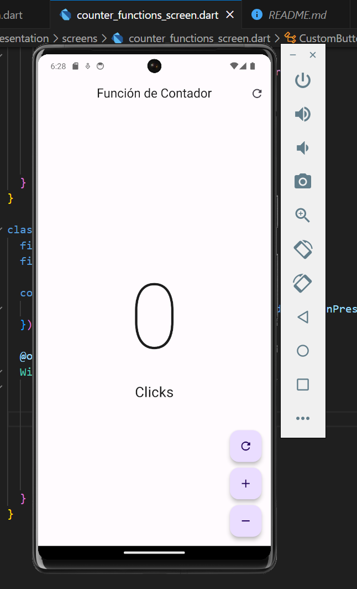

## Introduce a Flutter APP

This Flutter project is a simple counter application that allows users to increment, decrement, and reset a counter. It demonstrates basic Flutter concepts and usage of widgets.

### **Select Language:**
- [Español (Spanish)](README-es.md)
- [English](README.md)

## Result
### Home
 
### Sum
 
### Remove 

### Restart
 


### Getting Started

1. Ensure you have Flutter installed. If not, follow the [official Flutter installation guide](https://flutter.dev/docs/get-started/install).
2. Clone this repository to your local machine.

```bash
git clone https://github.com/Anyel-ec/INTRODUCE-DART-FLUTTER-DEVMOVIL
```

3. Navigate to the project directory.

```bash
cd hello_word_app
```

4. Run the app.

```bash
flutter run
```

### Project Structure

The project is organized into the following main files:

- **main.dart**: Entry point for the application, where the `MyApp` widget is defined.
- **counter_functions_screen.dart**: Contains the `CounterFuntionsScreen` widget, which represents the main screen of the app.
- **custom_button.dart**: Defines the `CustomButton` widget, which is a reusable custom floating action button.

### How to Use

1. Launch the app, and you will be presented with the main screen.
2. The counter value is displayed in a large font at the center of the screen.
3. Use the floating action buttons at the bottom to interact with the counter:
   - **Refresh Button**: Resets the counter to 0.
   - **Add Button**: Increments the counter.
   - **Remove Button**: Decrements the counter (disabled when the counter is already 0).

### Code Overview

- **MyApp Class**: The main application class that sets up the theme and initializes the `CounterFuntionsScreen`.
- **CounterFuntionsScreen Class**: Represents the main screen of the app. It utilizes the `_CounterFuntionsScreenState` to manage the state of the counter.
- **CustomButton Class**: A reusable custom floating action button that takes an icon and an `onPressed` callback.

### License

This project is licensed under the Apache 2.0 License - see the [LICENSE](LICENSE) file for details.

Feel free to explore, modify, and use this project as a foundation for your Flutter learning journey. If you have any questions or suggestions, please create an issue or pull request.

Happy coding! 🚀